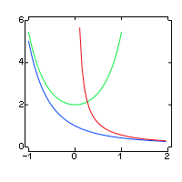

# erfcx
go implementation of the scaled complementary error function


```
    erfcx(x) is shown in blue, with the limits 2*exp(x*x) for negative x values and 
    (1/√π)(1/x) for large x values
```

 Package erfcx provides the scaled complementary error function for float64.

 This is a port of erfcx.c from libcerf-5.1 to go.
 
## Original documentation
```
 Library libcerf:
   Compute complex error functions, based on a new implementation of
   Faddeeva's w_of_z. Also provide Dawson and Voigt functions.

 File erfcx.c:
   Compute erfcx(x) = exp(x^2) erfc(x) function, for real x,
   using a novel algorithm that is much faster than DERFC of SLATEC.
   This function is used in the computation of Faddeeva, Dawson, and
   other complex error functions.

 Copyright:
   (C) 2012 Massachusetts Institute of Technology
   (C) 2013 Forschungszentrum Jülich GmbH

 Licence:
   Permission is hereby granted, free of charge, to any person obtaining
   a copy of this software and associated documentation files (the
   "Software"), to deal in the Software without restriction, including
   without limitation the rights to use, copy, modify, merge, publish,
   distribute, sublicense, and/or sell copies of the Software, and to
   permit persons to whom the Software is furnished to do so, subject to
   the following conditions:

   The above copyright notice and this permission notice shall be
   included in all copies or substantial portions of the Software.

   THE SOFTWARE IS PROVIDED "AS IS", WITHOUT WARRANTY OF ANY KIND,
   EXPRESS OR IMPLIED, INCLUDING BUT NOT LIMITED TO THE WARRANTIES OF
   MERCHANTABILITY, FITNESS FOR A PARTICULAR PURPOSE AND
   NONINFRINGEMENT. IN NO EVENT SHALL THE AUTHORS OR COPYRIGHT HOLDERS BE
   LIABLE FOR ANY CLAIM, DAMAGES OR OTHER LIABILITY, WHETHER IN AN ACTION
   OF CONTRACT, TORT OR OTHERWISE, ARISING FROM, OUT OF OR IN CONNECTION
   WITH THE SOFTWARE OR THE USE OR OTHER DEALINGS IN THE SOFTWARE.

 Authors:
   Steven G. Johnson, Massachusetts Institute of Technology, 2012, core author
   Joachim Wuttke, Forschungszentrum Jülich, 2013, package maintainer

 Website:
   http://apps.jcns.fz-juelich.de/libcerf
```
